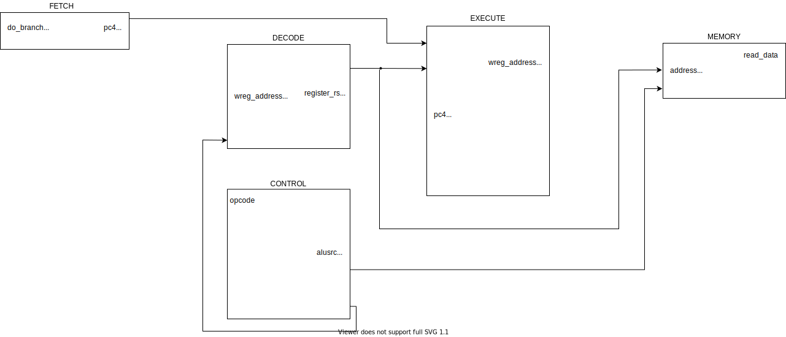

Go ahead and [download](assignment.zip) the assignment.

Also, makes sure that you have [iverilog](/resources/cocotb/cocotb#dependencies) installed.

# Assigment

1. Simulate the verilog Mips processor by running ``make`` in the RTL directory.
   
    Take a screenshot of the resulting waveform

2. Browse through the codebase and connect the different modules in the diagram below. A few lines have already been filled in for you.

    It might help to start by browsing ``mips.v``.

    

3. Go ahead and modify the codebase to support the Mips slt instruction.
Hint: you'll need to modify ``execute.v``

    You can also refer to the truth table [below](#truth-table).

4. How can you verify the ``slt`` instruction is now working? What might you have to change in ``fetch.v``?

    Go ahead and implement those changes.

    Insert a screen capture of the waveform that shows that slt now works.

# Some Notes

Here are some things to keep in mind as you do the assignment.

 - The verilog codebase itself isn't very representative of well designed RTL. The codebase itself reflects the architecture presented in the slides, which was unfortunately designed from a circuit level.
 - Technically - in a real processor, you should
be setting the value of a register before you use
it if you haven't done so since the processor restarted. In the codebase, for simplicity from the student's perspective, each register is initialized to the value of its number index.
 - A process block such as ``always`` executes anytime 
any of its arguments change state. If you have ``always(*)``,
the process block executes anytime any inputs in
the module change state which effectively implements
combinational logic.
 - You should become familiar with the concatenation and
replication operators [here](http://www.asic-world.com/verilog/operators2.html)
 - ``control.v`` could technically be a part of ``decode.v``

# Truth Table

|    | Opcode   |   ALUOp | Operation        | Function   | ALU function     |   ALU control |
|---:|:---------|--------:|:-----------------|:-----------|:-----------------|--------------:|
|  0 | lw       |      00 | load word        | XXXXXX     | add              |           010 |
|  1 | sw       |      00 | store word       | XXXXXX     | add              |           010 |
|  2 | beq      |      01 | branch equal     | XXXXXX     | subtract         |           110 |
|  3 | R-type   |      10 | add              | 100000     | add              |           010 |
|  4 | R-type   |      10 | subtract         | 100010     | subtract         |           110 |
|  5 | R-type   |      10 | AND              | 100100     | AND              |           000 |
|  6 | R-type   |      10 | OR               | 100101     | OR               |           001 |
|  7 | R-type   |      10 | set-on-less-than | 101010     | set-on-less-than |           111 |
